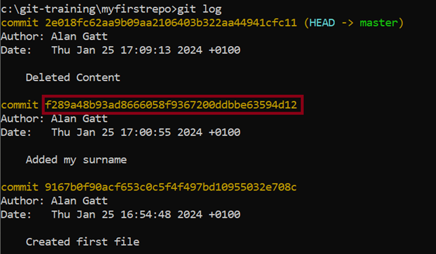

# GIT - Version Control System

Git is a version control system that allows multiple developers to work on the same project without interfering with each other's work.

It is important because it allows developers to track changes, revert to previous versions of code, and understand the history of a project.

## Installation Guide

To install Git, go to [https://git-scm.com/](https://git-scm.com/) and download the version suitable for your OS, and complete the installation process. For this installation we
can leave all options as proposed by the installer.

After finishing the installation, open a terminal window and type the following to check the current version of git installed on your system.

```
git --version
```

Now, we can set our email address and our name. In the same terminal type:

```
git config --global user.name "Your Name"
git config --global user.email youremail@example.com
```

To review all your settings, you can type:

```
git config --list
```

Otherwise, if you just want to check a value for a setting you can:

```
git config user.email
```

## Basic Commands

For our first example, we will create an empty repository and test various git commands. Choose a folder (or create one) where you will be placing git folders. For instance, you can create a folder in `C:\` named `git-training`.

Open terminal, go to this directory, and create an empty folder named `myfirstrepo` using the command:

```
cd c:\git-training
mkdir myfirstrepo
cd myfirstrepo
```

If you type dir inside this folder, it will show you that it’s empty. To set up a new repository, we can use:

```
git init
```

This will set up a new repository inside the folder, which can be seen by a newly created folder named `.git`. If you cannot see it, make sure that your OS is showing hidden files. Now, anything that we do inside this folder will be tracked by git.

So, let’s create a new text file and put a text message in it and save it as `My First File.txt`, you can do it using the GUI or in terminal:

```
echo My name is Abe > "My First File.txt"
```

Now, to check if git has tracked any of your changes we can use:

```
git status
```

Status shows two things; that there are no files and commits on branch master (this is the default branch), and that the file `My First File.txt` is not being tracked. Now, in git we have two steps:

- the staging step where we add files before committing.
- the commit step, in which a final snapshot is taken for all the files placed in staging.

So, first let’s add the file to the staging area:

```
git add "My First File.txt"
```

Now, if we check the status again, you will see that the file is being tracked. To save a snapshot of it we use commit. It’s important to supply an adequate message when committing to keep track of what was done during that commit.

```
git commit -m "Created first file"
```

If, you check the status again, you will see that the file has been committed, and there are no changes to be committed. To review the history of the repository and all the commits that happened you can use:

```
git log
```

## More Commit Operations

Now, open the text file with a text editor, and make some changes to it. Check the status of the repository, it should show that something has changed. Add the file to the staging area, and then commit. Finally, check the repository log.

```
git status
git add "My First File.txt"
git commit -m "Added my surname"
git log
```

### Restoring a File

What if you made a mistake, and want to discard any changes done to a file? Open the text file again and add some text to it. Save and close it. Check the status of the repository.

```
git status
```

You should see that changes were made to our file. In this case, we do not want these changes, so we are going to remove them:

```
git restore "My First File.txt"
```

If you check the status again, there will be no changes. Also, if you open the file, you should see that the latest changes were removed.

### Reset a Commit

Delete the content from the file, and then add the changes, and commit it.

```
git add "My First File.txt"
git commit -m "Deleted Content"
```

Now, the file will be empty. Let’s assume that this was a mistake, and we want to go back. Let’s start by checking the commits:

```
git log
```

Let’s delete our last commit; to do this we must determine its commit code.



So, in order to delete our latest commit:

```
git revert f289a48b93ad8666058f9367200ddbbe63594d12
```

Now restore the file and the last changes should be removed.

```
git restore "My First File.txt"
```

Also, if you check the log, now you will see that the final commit is not there, it’s like it never happened.

### Reverting to a Previous Commit

Let’s repeat the process, so delete the content of a file, add the file to the staging area and commit it again. Check the log, you should have three commits. This time, instead of deleting the last commit, we will undo it and create an additional commit. We must use the code for the last commit.

```
git revert 695b1902e5b133c84aa5bcfe9dcc7320998c8da1
```

This will ask you for a message, enter the message and confirm.

> Note: If vim was opened as a text editor you can exit and save from it by pressing `escape` and then type `:wq` and press `Enter`. Check the git logs, and you should see another commit reverting the changes. If you open the file, you will see that it has content again.

## Multiple Branches

In Git, multiple branches can be used in the same repository. This allows for organised development, where several features can be developed simultaneously. By using branching, each feature can be developed independently without affecting the main codebase known as `main` or `master`.

Consider building a web application where the main application would be on the `master` branch. Let’s say two developers are working on two different features, one is developing visualisations and the other user authentication. Each of these developers can create their own branch say (`user-auth`, and `data-viz`), and they won’t affect either each other, or the main code. This will allow each developer to experiment without worrying about affecting each other, or the main code. Once the features are complete and tested, they can be merged back into the `master` branch.

Let’s create a new branch called `testing`.

```
git branch testing
```

This will create a new branch called testing but make sure to make it active by switching to it. Use `git status` to determine on which branch you’re on. To switch we can use:

```
git checkout testing
```

Now, anything that we will do will be limited to the `testing` branch and won’t affect our original `master` branch. Create a new file named `Testing.txt` and commit it to the `testing` branch.

```
echo This is a testing file > "Testing.txt"
git add "Testing.txt"
git commit -m "Added Testing file"
```

So, now in our `myfirstrepo` folder you will have two files `My First File.txt` and `Testing.txt`. However, if we switch to the `master` branch the new file `Testing.txt` will not be there. Test it out:

```
git checkout master
```

Now, let’s say that we’re ok with the content of the `testing` branch and want to copy it to the `master` branch, we can do this using:

```
git merge testing
```

The file that was present in testing is now visible in the `master` branch as well.

### Final Steps

You can delete this repository since it will not be used anymore.

## Additional Resources

- Git Scm Documentation - https://git-scm.com/doc
- Github Git Guides - https://github.com/git-guides
- Git Cheat Sheet - https://training.github.com/downloads/github-git-cheat-sheet/
