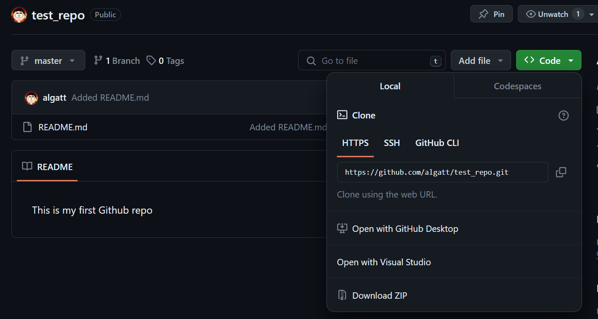

# Using Github

Github offers to host your repository online. This way, your repositories can be backed up and also shared across different users.

## Create an Account

Let's start by heading to https://www.github.com and create an account unless you alread have one.

## Create an Online Repository

After you create the account, create a new repository. In the repository name we can set it as `test_repo`, you can add a description `This repo will be used for training purposes`. You can leave it as `public` for now; however you can set repositories to `private` where no one except users that are given persmissions can access it. For now, let's skip the other options, and click on `Create Repository`.

## Linking with the Online Repository

After the repository is created, we can now link it to a local repository. Let's open a terminal window and go to the folder `git-training`. Perform the following steps:

Create a new folder `test_repo`

```
mkdir test_repo
```

Switch to the folder and initialize a repository

```
cd test_repo
git init
```

Create a `README.md` file

```
echo This is my first Github repo > "README.md"
```

Add the `README.md` file

```
git add README.md
```

Commit the the file

```
git commit -m "Added README.md"
```

Link this repository to the Github repository. You can get the URL by clicking the `Code` button in the repository homepage.



```
git remote add origin https://github.com/algatt/test_repo.git
```

Finally, we can push to this repository.

```
git push -u origin master
```

Now, if you go on Github repository's homepage, you can see the README.md file has been uploaded.

## Adding More Files

Create three more files, andd add them all and commit them. You can use `git add .` to add all changes.

```
git add .
git commit -m "Added 3 Files"
```

Now, we can push to the remote repository simply using

```
git push
```

## Creating a New Branch

We can still push a new branch to the Github. If, you create a local new branch, and make changes to it, the first time you push it, you need to use the `-u origin` flag. Let's test it:

```
git branch testing
git checkout testing
git push -u origin testing
```

Now, the new `testing` branch is created and can be used normally.

## Pulling Changes

Now, since the repository is hosted online. You can work on it from different devices, or you might even share it with other collaborators.

So, it's important that before starting making changes inside the repository, make sure it's up to date.

This can be done by using `git pull`.

If this is not done before you make any changes, you might have inconsistencies, and conflicts in files.

### Final Steps

You can delete this repository both locally and on Github since it will not be used anymore.
