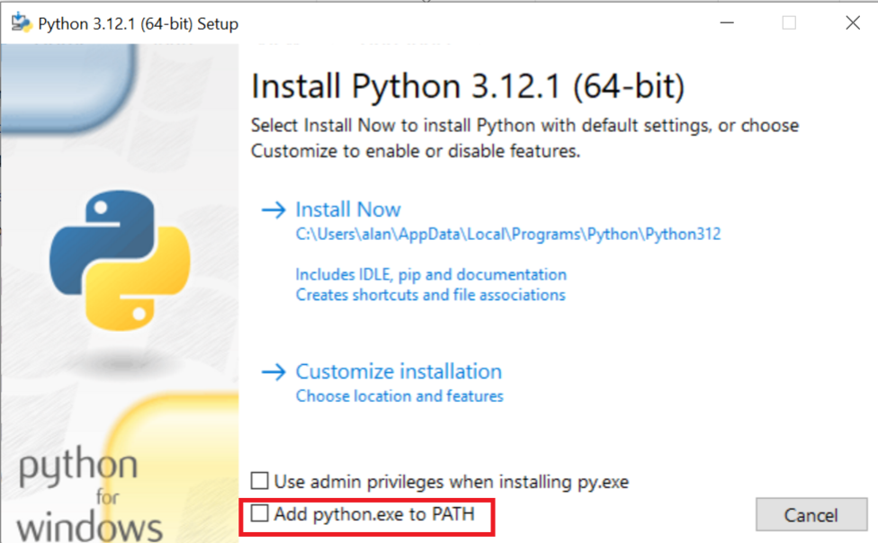

# Installation Guide

## Python

First step is to install Python. Go to [Python.org](https://www.python.org/), and download the latest version for your OS.

Start the installation, you can choose the default installation option `Install Now`, but make sure to tick the option `Add python.exe to PATH`.



To check that Python has been installed correctly on your system. Open a terminal and type `python --version`. It should return the version of your installed Python.

## Visual Studio Code

### Installation

Go to [Visual Studio Code](https://code.visualstudio.com/), and download the latest version for your OS.

Start the installation, and you can accept all the default options.

### Setting Up

Run Visual Studio Code, if you're running it for the first time, go through the questions to personalise it.

From the left sidebar, click on Extensions (`CTRL+SHIFT+X`). Search for `Python` and install the one published by `Microsoft`.

After it installs, create a new Text File `CTRL+N`, and save it as `test.py`. In this file enter this line of code:

```
print ('hello')
```

Then press the run button in the top right part of VS Code. If everything is set up correctly, you will see a message `hello` in the terminal section of VS Code.

### Linting

Linting will help properly format your code, and highlight any errors in your code.

In the extensions look for `Pylint` which is published by Microsoft, and install it. After installing it, it will highlight the problems in your code. You can see all the problems by pressing `CTRL+SHIFT+M`.

### Auto Formatting

Although linting helps us with identifying inconsistencies or errors in our code, we can apply auto formatting to code to resolve (certain) problems automatically.

In the extensions look for `Black Formatter`, published by Microsoft, and install it. After installing it, press `CTRL+SHIFT+P`, type `User Settings`, and choose the option `Preferences: Open User Settings (JSON)`.

If it's a new VS Code installation your settings will be something like:

```
{
    "workbench.colorTheme": "Default Dark Modern",
}
```

We need to add the following to set the formatter, and make it format on saving a file.

```
{
    "workbench.colorTheme": "Default Dark Modern",
    "[python]": {
        "editor.defaultFormatter": "ms-python.black-formatter",
        "editor.formatOnSave": true
      }
}
```

Reload VS Code, by pressing `CTRL+SHIFT+P` and type `Reload` and choose `Developer: Reload Window`.

Now, try introducing a few errors or inconsistencies in your code, for instance do this:

```
print      ("hello")
print ('hello again')
```

Save the file (`CTRL+S`), and it will format them as follows:

```
print("hello")
print("hello again")
```

### Jupyter Extension

The last extension we need is `Jupyter` by Microsoft for Jupyter Notebooks. This will allow us to create notebooks that can contain both markdown (text) and Python code. Installing this extension will install `Jupyter Keymap`, `Jupyter Notebook Renderers`, `Jupyter Cell Tags`, and `Jupyter Slide Show`.

After installing them, reload the window (or close and open VS Code). Press `CTRL+SHIFT+P` and type `New Notebook`, choose the option `Create: New Jupyter Notebook`. This will create a notebook with an empty Python cell.

Change this cell to a markdown cell by clicking on `Python` in the bottom right, and choosing `Markdown`. In the Markdown box, type `This is a Notebook test` and press `CTRL+ENTER`.

Then create another code cell, and in it type:

```
print ('This is a code cell')
```

Press `CTRL+ENTER` or click on the little arrow in the left side of the box. If this is your first time running a Jupyter Notebook, it will ask for access, and to install `ipykernel` package. Click on `Install`. It will download a number of packages, and then if everything went well, it will display the output.
