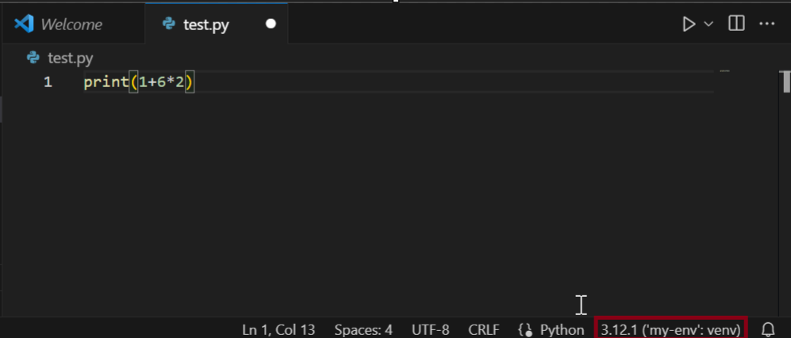

# Virtual Environments

Python installations can become cluttered when many libraries get installed. Also, there can be problems with package versions, you might need to install libraries that are either incomptible with each other or with the current Python version you have installed.

To solve this problem we can use virtual environments for every project that we are working on. This means that every project will be isolated from the rest and can have its own packages, python version, etc... There are two main tools that can be used for this [virtualenv](https://virtualenv.pypa.io/en/latest/) and [Anaconda](https://www.anaconda.com/).

For the scope of our unit we will be using `venv`.

## Installing virtualenv

First thing, we must install `virtualenv` using our current Python installatioin. To do this open terminal, and using Python's package manager `pip` we use:

```
pip install virtualenv
```

That's it, now we can use `virtualenv` whenever we start a new project.

> Note: If you have a warning that pip is outdated you can use `python -m pip install --upgrade pip` to updgrade it.

## Creating a new Environment

Create a folder `example-env` in your workspace. Open this folder in Visual Studio Code. If there's a popup for Trust, you can choose to accept and trust the authors (since it's you).

Open a terminal window in VS Code (View > Terminal) or <code>CTRL+`</code>. In this terminal window we can create our new environment

```
python -m virtualenv --python=3.12 my-env
```

> Note: You can install older versions of Python, but these have to be pre-installed on your system. For instance to use Python 3.10 you have to install it first and then use `python -m virtualenv --python=3.10 my-env`.

This will create a folder with the name that you've given `my-env`. All of the packages will be saved here. Inside `my-env` folder there is a `.gitignore` file since the workspace is never uploaded to GitHub.

## Testing the Environment

Create an empty Python file named `test.py` and in it you can type this code:

```
print(1+6*2)
```

Click, on the bottom right section of the screen where the Python version and environment are showing and make sure to select the current environment.



Run the script and see that it works.

## Installing Packages

Next we will install a package in this newly generated environment. Open terminal window again and type:

```
.\my-env\Scripts\activate
```

In this environment, install the `pandas` library.

```
pip install pandas
```

> Note: After installing new packages, it's ideal to refresh VS Code, by pressing `CTRL+SHIFT+P` and typing `reload` and choose `Developer: Reload Window`. This will make sure that indexes are updated.

Revise the `test.py` script to the following and run it.

```
import pandas as pd

nums = pd.Series([3, -5, 7, 4])
print(nums)
```

Now, let's change the environment to the default Python installation, and try to run it again.

It will return an error since `pandas` will not be found. This means that our environments have worked successfully. Make sure to switch back to the working environment.

## Saving Configuration

If you want to save the environment settings (the packages installed) you can use `freeze` to generate a file with the requirements.

In the terminal window, make sure you have the environment active and type:

```
python -m pip freeze > requirements.txt
```

This will generate a file named `requirements.txt` and it contains all the packages being used, such as:

```
numpy==1.26.3
pandas==2.2.0
python-dateutil==2.8.2
pytz==2023.4
six==1.16.0
tzdata==2023.4
```

This file can be used to install are required packages next time a new environment is created. Simply, paste the file in the project's folder and run

```
pip install -r requirements.txt
```

## Deactivate an Environment

To deactivate an environment from terminal, simply type:

```
deactivate
```
