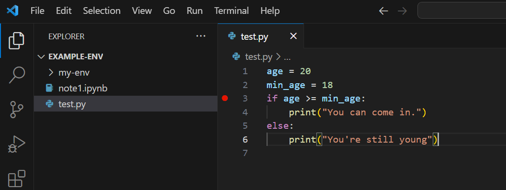
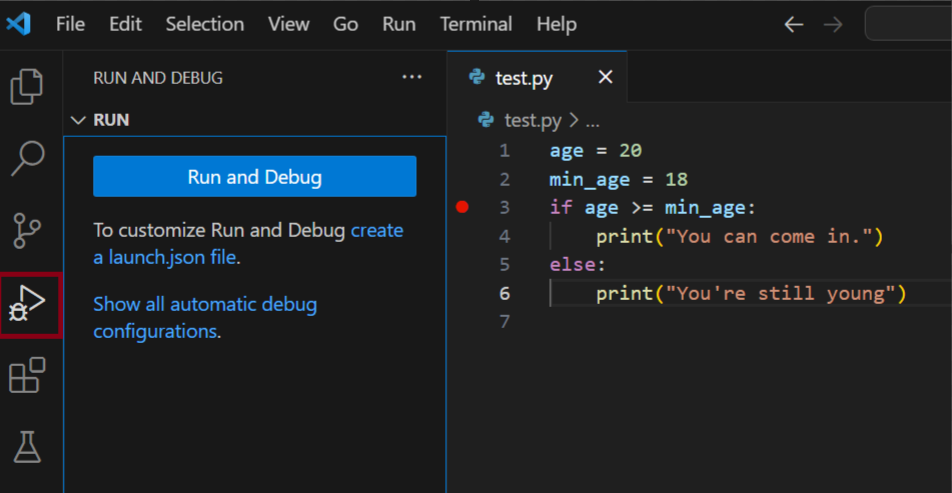
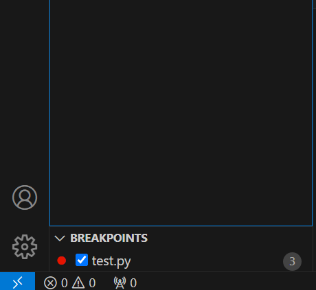
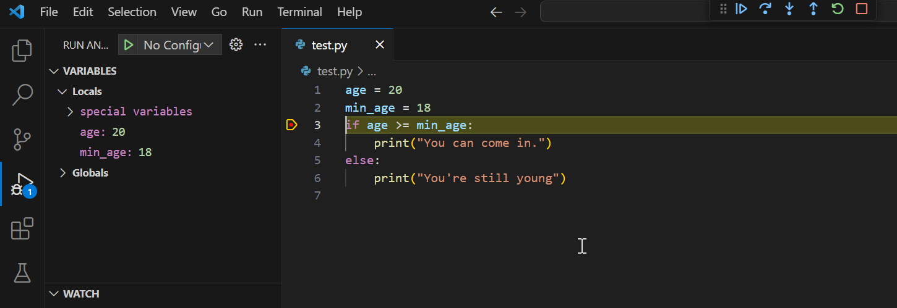
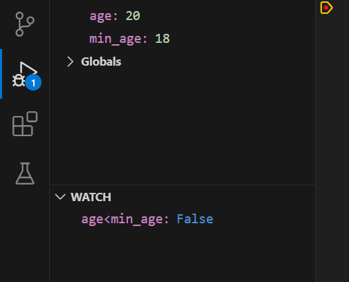

# Debugging Python in VS Code

Debugging in VS Code for Python involves identifying and fixing errors in Python code using Visual Studio Code's integrated development environment (IDE).

This process includes setting breakpoints to pause code execution, inspecting variables and their current state, stepping through code line-by-line, and viewing logs and error messages.

Deubgging is a systematic approach to locate and resolve issues in Python scripts, improving code reliability and performance.

## Debug my Script

Create an empty Python file and save it as `test.py`. We can fill it in using a simple `if` statement as follows:

```
age = 20
min_age = 18
if age >= min_age:
    print ("You can come in.")
else:
    print ("You're still young")
```

If we run this script it should display `You can come in.` since `age` is bigger than `min_age`. What if we want to check what each variable contains during exection?

### Setting a Breakpoint

To set a breakpoint click to the left of the line number. In this case click just before line 3. This will add a red circle indicating a breakpoint has been created.



Now, from the left sidebar, choose `Run and Debug`.



In the bottom section of the `Run and Debug` it will show you all selected breakpoints (you can have several).


<br/>
<br/>

If you hover on `BREAKPOINTS` it will show you options to add more breakpoints, disable breakpoints or simply remove them all.

On the other hand, if you hover over an individual breakpoint you can remove it, or add a condition when the breakpoint is triggered.

The first time we start the `Run and Debug` process it allows us either to start the process or set up a `launch.json` file, in which we can set some parameters for debugging which can be used again later.

In this case we click on `Run and Debug` and from the Debug Configuration choose `Python File`. The script will be executed, but it will stop where we set the breakpoint.



As you can see, on the left side you can see the contents of the variables, in this case `age` is set to `20` and `min_age` to `18`.

At the top you can see varoius commands for debugging:

- Continue (F5): Continues executing the script
- Step Over (F10): If a function is next, the debugger does not go into it, but executes it as a single line of code
- Step Into (F11): If a function is next, it will go into it and continue with each line in the function.
- Step Out (Shift + F11): If inside a function we exit it and continue at the next line.
- Restart (Ctrl + Shift + F5): Restart the debugger.
- Stop (Shift + F5): Stop the debuger.

You can continue by choosing Step Over (F10), and as you can see it goes in the first `if` statement since in this case `age` is bigger than `min_age`.

### Watches

During the debugging process, you can also evaluate expressions. Restart the debugger, and wait until it arrives at the breakpoint.

In the Watch section (left-hand side) click on +, and type an expression, let's try `age<min_age`. This is evaluated with the current values of the variables, and the result is immediately displayed.


<br/>
<br/>
